Restful Api 
===============

[Toc]

## 说明

restful风格的API，集API请求处理，权限认证，自动生成文档等功能；

 - restful风格处理请求
 > 每个接口对于一个控制器，method对应[method]Response方法响应

 - 权限认证
 > 以access_token进行权限认证
 
 - 文档生成
 > 简洁，优雅，不需要额外的文档工具;
 
 
## 相关依赖
 - [PHP5.4+]()
 - [ThinkPHP5.0](https://github.com/top-think/think) 基础框架
 - [RandomLib](https://github.com/ircmaxell/RandomLib) 用于生成随机数和字符串的库
 - [Hadmin](https://git.oschina.net/liushoukun/hadmin.git) hAdmin是一个免费的后台管理模版,该模版基于bootstrap与jQuery制作，集成了众多常用插件，基本满足日常后台需要,修改时可根据自身需求;
 

## 目录结构


~~~
apilib
├─application           应用目录
│  ├─apilib             apilib目录
│  │  ├─Common.php      公共类库基础Rest
│  │  ├─BaseRest.php    Restful风格基础类
│  │  ├─BaseAuth.php    认证基础类
│  │  ├─BaseDoc.php     文档生成展示
│  │  ├─Behavior.php    行为类
│  │  └─ ...            

~~~


## 安装

```
git clone  https://git.oschina.net/liushoukun/restfulapi-tp5.git
composer install
#如果要使用生成文档 需要在public/static/ 下 安装hadmin
cd /public/static/
git clone  https://git.oschina.net/liushoukun/hadmin.git
```


## 使用

 1. 新建demo 模块
 2. 业务基础类继承 BaseRest
 

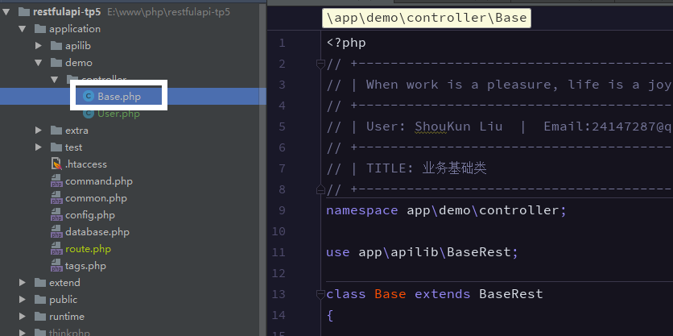

 3. 创建一个用户接口 User
 
- 添加路由 action需要填写init(会进行调用)


```php
'[v1]' => [
        'user' => ['demo/User/init',], //用户模块接口
    ],
```


- 设置允许访问的方式


```php
// 允许访问的请求类型
public $restMethodList = 'get|post';
```


- 重写 获取用户(get),post(新增用户)的相应方法 


> 因为方法的描述信息会设计到文档生,可以拷贝父级方法的描述.推荐使用phpstorm的 [ctrl + o](https://segmentfault.com/a/1190000004225643) 快捷键,点击添加注释；


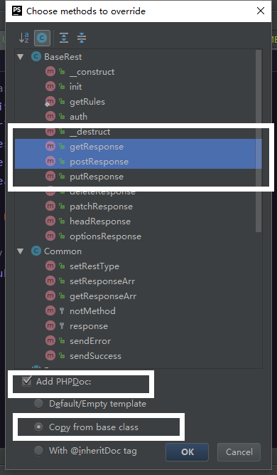


```php
   /**
     * @title 获取用户信息
     * @desc 获取用户信息
     * @readme /api/md/method.md
     * @param \think\Request $request
     * @return string message 错误信息
     * @return int errCode 错误号
     */
    public function getResponse(\think\Request $request)
    {
        //返回一个用户信息
        return $this->sendSuccess(['username' => 'api', 'age' => 1, 'id' => 1]);
    }
    /**
     * @title 添加用户信息
     * @desc 添加用户信息
     * @readme /api/md/method.md
     * @param \think\Request $request
     * @return string message 错误信息
     * @return int errCode 错误号
     */
    public function postResponse(\think\Request $request)
    {
        //添加失败
        return $this->sendError(5001, '添加错误');
    }

```

 
 4. 请求接口
 
  - GET的请求(获取用户信息)
  
  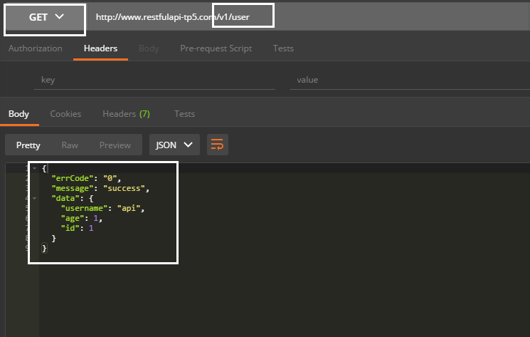
 
 - POST的请求(添加用户)
 
  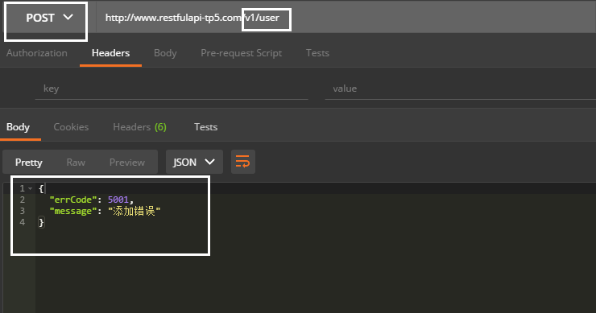

 - 其让未允许的响应
 
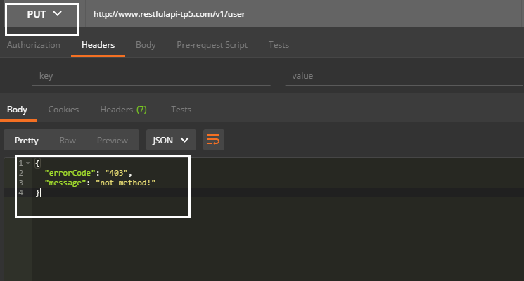


## 开启权限
  认证
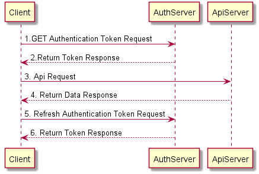

> 1. 客户端向认证服务器发起请求
> 2. 认证服务器确认用户返回access_token(客户端存储,并且有过期时间为7200s)
> 3. 客户端向携带access_token向接口服务器发起请求
> 4. 接口服务器认证access_token，响应
> 5. access_token过期可以向认证服务器refreshToken
> 6.同2

本代码认证服务器和接口服务器共用,服务器存储access_token信息采用缓存;


 1. 新建一个继承 BaseAuth 的控制器
 


 2. 添加路由

```php
//认证
'[oauth]' => [
    'accessToken' => ['demo/Auth/accessToken',],//获取令牌
    'refreshToken' => ['demo/Auth/refreshToken',],//刷新令牌
    'getServerTime' => ['demo/Auth/getServerTime',],//获取服务器时间戳
],
```

 3.添加配置 认证总开关
 
```
   'api_auth' => true,//是否开启API认证
```

 4.控制器开关 
  - 业务基础类设置开启
  
  
```php
//是否开启权限认证
public    $apiAuth = true;
```


 - 具体接口可覆盖
 
    
```php
//是否开启权限认证
public    $apiAuth = false;
```


|配置(api_auth)|类($apiAuth)|效用|
|:---:|:---:|:---:|
|true|true|认证开启|
|true|false|认证关闭|
|false|false|认证关闭|
|false|true|认证关闭|


 5. 默认用户

|名称|keys|value|必须|
|:---:|:---:|:---:|:---:|
|客户端账户名称|client_name|test|false|
|客户端账户id|client_id|11111111|true|
|加密秘钥|secret|qwekjznc120cnsdkjhad|true|
|权限列表|authorization|demo/User/init,|true|

可以根据 $client_id 改写

```php
     /**
      * 获取应用信息
      * @param $client_id 应用ID
      * @return array
      */
     protected function getClient($client_id)
     {
         return [
             'client_name' => 'test',//客户端账户名称
             'client_id' => '11111111',//客户端账户id
             'secret' => 'qwekjznc120cnsdkjhad',  //加密秘钥
             'authorization_list' => 'demo/User/init,',//权限列表
         ];
     }

```


6 获取[access_token](host/oauth/accessToken) 和  [refresh_token_token](host/oauth/refreshToken)
地址是配置地址


|参数|必须|备注|默认值|
|:---:|:---:|:---:|:---:|
|client_id|true|客户端ID||
|time|true|请求时间||
|sign|true|签名md5(md5(client_id + time + secret))||
|grant_type|false|认证类型| client_credentials 或 refresh_token |


```html
/oauth/accessToken?client_id=11111111&time=1488685451&sign=b1df6b78bb099f8d7f0f1dc4ea3be1fe&grant_type=client_credentials
```


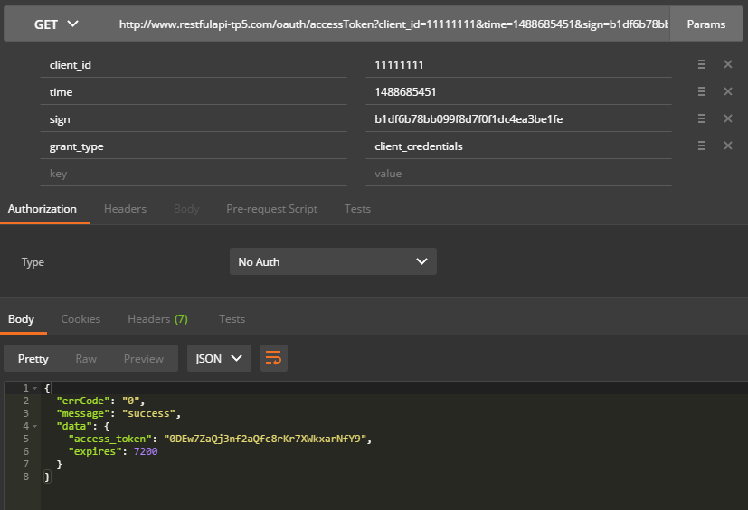
 
 

7. 请求接口 


headers  添加 "Authorization":"token [上一步获得的access_token]()"
  
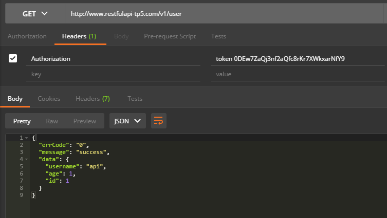
 

## 自动生成文档

1. 创建Doc文档显示控制器


> 访问[/demo/Doc/apiList](/demo/Doc/apiList)
 
2.配置文档显示目录


```php
    /**
     * 获取文档
     * @return mixed
     */
    public static function getApiDocList()
    {
        //todo 可以写配置文件或数据
        $apiList = Config::get('api_doc');
        return $apiList;
    }
```


>可以改写次方法以存储以无限极的方式，为了方便我采用的是配置方式


tp5 增加额外配置  创建application/extra/api_doc.php 文件


```php
return [
    '1' => ['name' => '测试文档', 'id' => '1', 'parent' => '0', 'module' => '', 'controller' => '','readme' =>''],//下面有子列表为一级目录
    '2' => ['name' => '获取权限', 'id' => '2', 'parent' => '1', 'module' => '', 'controller' => '', 'readme' => '/doc/md/auth.md'],//没有接口的文档，加载markdown文档
    '3' => ['name' => '用户接口', 'id' => '3', 'parent' => '1', 'module' => 'demo', 'controller' => 'User', 'readme' => ''],//User接口文档
];
```


|参数|必须|备注|作用|
|:---:|:---:|:---:|:---:|
|name|true|接口列表名称|显示列表名称|
|id|true|主键|生成列表所用|
|parent|true|生成列表所用|
|module|true|模块名|用于生成具体接口文档|
|controller|true|用于生成具体接口文档|
|readme|true|markdown|可以生成没有接口的文档，比如一些说明 module和controller为空,readme填文档路径|
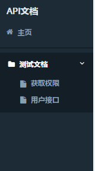


3.具体接口文档配置


- 接口描述部分(类文件的注释)


```php
/**
 * Class User
 * @title 用户接口
 * @url /v1/user
 * @desc  有关于用户的接口
 * @version 1.0
 * @readme /doc/md/user.md
 */
class User extends Base{}
```


|参数|必须|备注|作用|
|:---:|:---:|:---:|:---:|
|title|true|接口标题|显示列表名称|
|url|true|请求地址|用户显示|
|desc|true|接口描述|显示描述|
|version|false|版本号|版本号|
|readme|false|markdown文档|可以编写信息文档|


- 具体接口文档


 1. 接口描述信息(注释填写)
 
 
```php
       /**
        * @title 获取用户信息
        * @desc 获取用户信息
        * @readme /doc/md/method.md
        */
      public function getResponse(\think\Request $request){}

```


|参数|必须|备注|作用|
|:---:|:---:|:---:|:---:|
|title|true|接口标题|显示列表名称|
|desc|true|接口描述|显示描述|
|readme|false|markdown文档|可以编写信息文档|

   2.请求参数
   
   
```php
    /**
     * 参数规则
     * @name 字段名称
     * @type 类型
     * @require 是否必须
     * @default 默认值
     * @desc 说明
     * @range 范围
     * @return array
     */
    public static function getRules()
    {
        $rules = [
                //共用参数
                'all'=>[
                    'time'=> ['name' => 'time', 'type' => 'int', 'require' => 'true', 'default' => '', 'desc' => '时间戳', 'range' => '',]
                ],

                'get'=>[
                    'id' => ['name' => 'id', 'type' => 'int', 'require' => 'true', 'default' => '', 'desc' => '用户id', 'range' => '',]
                ],
                'post'=>[
                    'username' => ['name' => 'username', 'type' => 'string', 'require' => 'true', 'default' => '', 'desc' => '用户名', 'range' => '',],
                    'age' => ['name' => 'age', 'type' => 'int', 'require' => 'true', 'default' => '18', 'desc' => '年龄', 'range' => '0-200',],
                ]
        ];
        //合并父级类参数
        return array_merge(parent::getRules(),$rules);
    }
```


  

   3. 返回参数(注释填写)
   
   
```php
     * @return int id ID
     * @return string username 错误信息
     * @return int age 年龄
```


|参数|必须|备注|
|:---:|:---:|:---:|
|第一个参数|true|类型|
|第二个参数|true|参数名|
|第三个参数|true|参数说明|


>类型填写规则


```php
'string'    => '字符串',
'int'       => '整型',
'float'     => '浮点型',
'boolean'   => '布尔型',
'date'      => '日期',
'array'     => '数组',
'fixed'     => '固定值',
'enum'      => '枚举类型',
'object'    => '对象',
```

  
整体效果
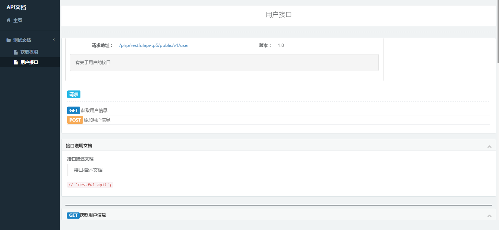
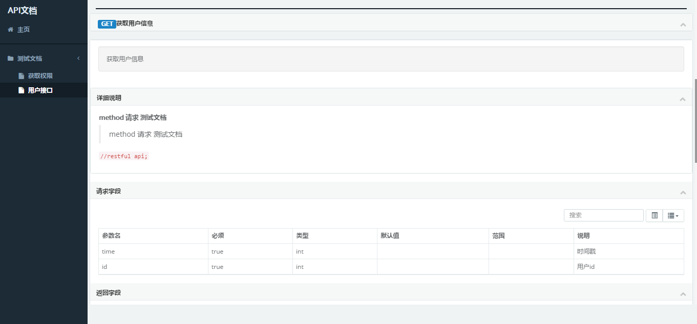
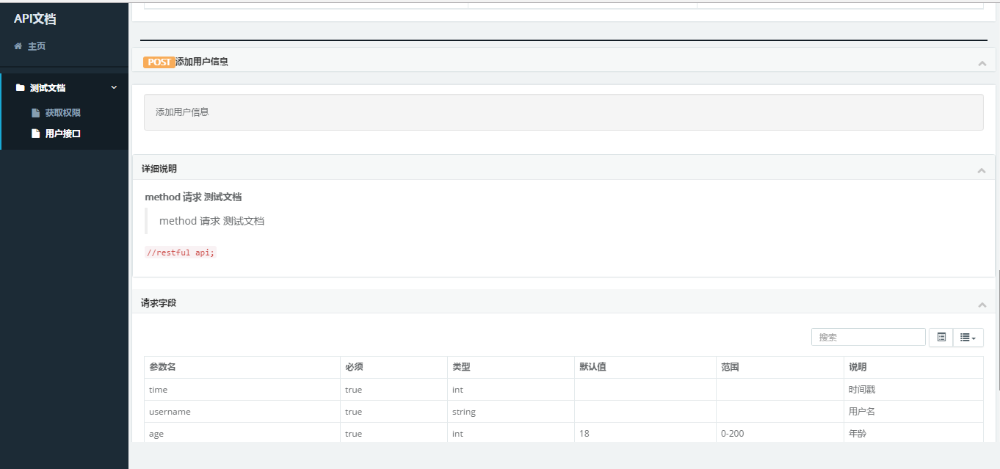
 

  


## 开发文档参考


 - [ThinkPHP5完全开发手册](http://www.kancloud.cn/manual/thinkphp5)
 - [restfulApi设计指南](http://www.ruanyifeng.com/blog/2014/05/restful_api.html)
 - [OAuth 2.0](http://www.ruanyifeng.com/blog/2014/05/oauth_2_0.html)
 
 

## 开发工具推荐
 - IDE PHPSTORM
 - 模拟请求 Postman


